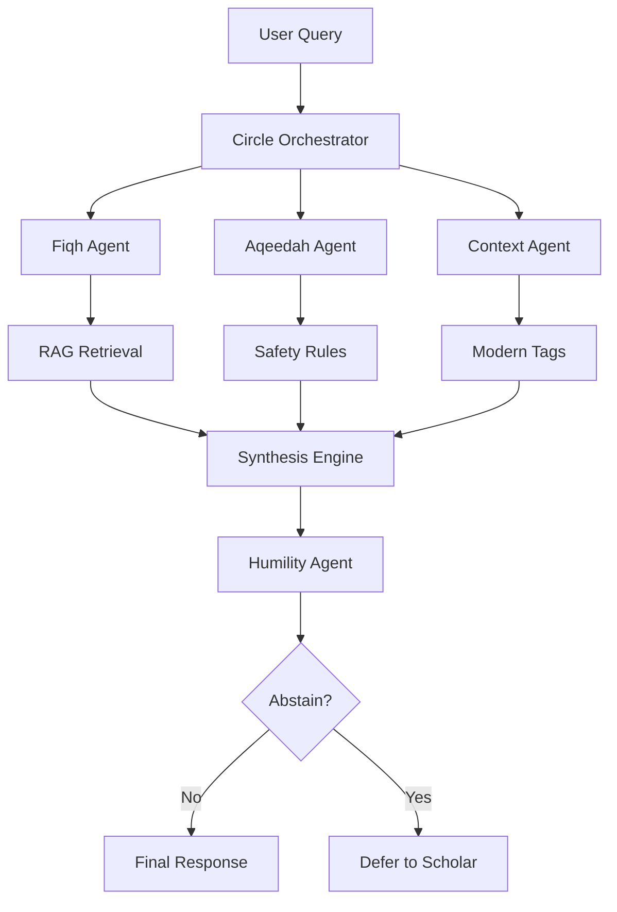

# XamSaDine AI v2.0 - LLM Council Platform

> **The Circle of Knowledge**: A sophisticated distributed multi-agent consensus system powered by 4 expert LLMs working together to provide nuanced, well-reasoned responses to complex questions.

[](https://opensource.org/licenses/MIT)
[](https://www.typescriptlang.org/)
[](https://reactjs.org/)
[](https://nodejs.org/)

---

## 🎯 Overview

XamSaDine AI v2 is a complete **LLM Council Platform** that harnesses the power of four diverse language models through OpenRouter to provide comprehensive, multi-perspective analysis of complex questions. The system implements distributed consensus, peer review, and retrieval-augmented generation for knowledge-informed responses.

### ✨ Key Features

- **🤖 4 Expert Council Members**: Diverse models (Claude, GPT-4o, Mistral, Llama) with specialized roles
- **🔄 Distributed Consensus**: Independent analysis with peer review and agreement scoring
- **📚 RAG Integration**: Semantic search and document management for contextual knowledge
- **🎨 Beautiful UI**: Production-ready interface with real-time visualization
- **🔌 Complete REST API**: Full-featured endpoints for council operations
- **📈 Analytics**: Consensus scoring, performance metrics, and insight tracking
- **🚀 Production Ready**: Docker support, deployment guides, and scaling documentation
- **🎨 Modern UI**: Clean, responsive interface built with React + Tailwind CSS
- **🔐 Epistemic Integrity**: No lateral communication between agents ensures methodological purity

---

## 🏗️ Architecture



### Agents

- **Fiqh Reasoning Agent**: Jurisprudential analysis across 4 Sunni Madhhabs (Hanafi, Maliki, Shafi, Hanbali)
- **Aqeedah Boundary Agent**: Theological safety guardrails (Takfir/Bid'ah detection)
- **Contemporary Context Agent**: Modern implication tagging (crypto, AI, fintech, etc.)
- **Humility & Abstention Agent**: Confidence evaluation and scholarly restraint

---

## 🚀 Quick Start

### Prerequisites

- Node.js 20.x or higher
- npm 9.x or higher
- (Optional) OpenAI/Anthropic API keys for LLM integration

### Installation

```bash
# Clone repository
git clone https://github.com/yourusername/xamsadine-ai-website-v2.git
cd xamsadine-ai-website-v2

# Install dependencies
npm install

# Start frontend (Vite)
npm run dev

# Start backend (separate terminal)
cd backend/services/api-gateway
npx tsx src/server.ts
```

Frontend will run on `http://localhost:8080` (or another port shown in terminal).  
Backend API Gateway will run on `http://localhost:4000`.

---

## 📖 Usage

### 1. **Circle of Knowledge** (`/circle`)
Submit queries and see multi-agent reasoning in action.

### 2. **Admin Configuration** (`/admin`)
- Assign LLMs to each agent (OpenAI GPT-4, Claude, local models)
- Configure temperature, max tokens
- Enter API keys (stored locally)

### 3. **Document Upload** (`/documents`)
- Drag-and-drop PDFs, TXT, MD files
- Categorize by Madhhab or domain (Fiqh-Hanafi, Aqeedah-Ashari, etc.)
- Documents are chunked and ready for RAG retrieval

---

## 🔧 Configuration

### LLM Providers

Edit `backend/config.json` (auto-generated on first run) or use the Admin UI:

```json
{
  "agents": {
    "fiqh": {
      "agentId": "fiqh",
      "llmConfig": {
        "provider": "openai",
        "model": "gpt-4",
        "apiKey": "sk-...",
        "temperature": 0.3,
        "maxTokens": 2000
      },
      "enabled": true
    }
  }
}
```

Supported providers:
- `openai` - OpenAI API (GPT-4, GPT-3.5)
- `anthropic` - Anthropic API (Claude)
- `local` - Local models via endpoint (e.g., Ollama)

### Document Categories

When uploading documents, select the appropriate category:
- `fiqh-hanafi`, `fiqh-maliki`, `fiqh-shafi`, `fiqh-hanbali`
- `aqeedah-ashari`, `aqeedah-maturidi`, `aqeedah-athari`
- `context-modern`

---

## 📂 Project Structure

```
xamsadine-ai-website-v2/
├── backend/
│   ├── agents/                 # Epistemic agents
│   │   ├── fiqh.ts
│   │   ├── aqeedah.ts
│   │   ├── context.ts
│   │   └── humility.ts
│   ├── synthesis/              # Deterministic synthesis engine
│   │   └── engine.ts
│   ├── orchestrator/           # Circle orchestrator
│   │   └── circle.ts
│   ├── services/
│   │   ├── api-gateway/        # Express API server
│   │   ├── config-service/     # Agent configuration management
│   │   ├── llm-service/        # LLM provider abstraction
│   │   └── rag-service/        # Document upload & retrieval
│   └── shared/                 # TypeScript types
├── src/
│   ├── pages/
│   │   ├── Circle.tsx          # Circle of Knowledge UI
│   │   ├── AdminConfig.tsx     # Model configuration panel
│   │   └── DocumentUpload.tsx  # Document management UI
│   └── components/             # Reusable UI components
└── package.json
```

---

## 🧪 Testing

### Demo Mode (No API Keys)
The system runs in demo mode with mock data when no API keys are configured. This allows exploration of the UI and architecture without LLM costs.

### With Real LLMs
1. Navigate to `/admin`
2. Enter your OpenAI or Anthropic API key for the Fiqh agent
3. Go to `/circle` and submit a query
4. Observe real LLM-powered reasoning across Madhhabs

### RAG Testing
1. Upload documents via `/documents`
2. Wait for processing (status changes to "ready")
3. Queries to the Circle will retrieve relevant chunks (integration pending)

---

## 🎓 Research Background

This system implements the architecture described in:

> **"XamSaDine AI v2: A Multi-Agent Epistemic Architecture for Trustworthy Religious Reasoning"**

Key innovations:
- **Epistemic Independence**: Agents operate without lateral communication
- **Explicit Disagreement**: Ikhtilāf is preserved, not collapsed into consensus
- **Humility by Design**: System can abstain when evidence is insufficient
- **Configurable Expertise**: Different LLMs for different epistemic roles

---

## 🛠️ Development

### Adding a New Agent

1. Create agent file in `backend/agents/your-agent.ts`
2. Implement the agent interface:
   ```typescript
   export class YourAgent {
     async process(query: string): Promise<YourAgentResponse> {
       // Your logic here
     }
   }
   ```
3. Register in `backend/orchestrator/circle.ts`
4. Add configuration to `backend/services/config-service/config.service.ts`

### Frontend Development

The frontend uses:
- **React 18** with TypeScript
- **Vite** for bundling
- **Tailwind CSS** for styling
- **shadcn/ui** for components
- **React Router** for navigation

---

## 📝 License

MIT License - see LICENSE file for details

---

## 🙏 Acknowledgments

Built with guidance from classical Islamic scholarship and modern AI research principles.

---

## 📬 Contact

For questions or collaboration: [your-email@domain.com]

---

**Status**: 🚧 Beta - Core infrastructure complete, LLM/RAG integration in progress
